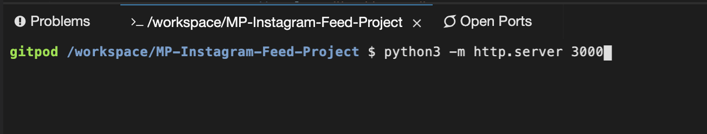

# MP-Instagram-Post
  Developed a sample Instagram page modeled after a personal user account, displaying a single post from that fictitious account (based on the company's design prior to their 2019 Spring update).

## Deployment Instructions (How to Open Project Live)
  This project was originally developed on and run through GitPod. If you'd like to view the page live in a browser, run "python3 -m http.server 3000" in the command terminal. Once entered, Gitpod will give you options to view the project; click "Open Browser". A new tab should open up displaying the page. 

  

  

## Build / Layout
  The project was developed using only HTML, CSS, Font Awesome (for the Icons), and Google Fonts (to match the Instagram typography as closely as possible).
  
  The following image is the example I was supposed to model my work after (the minimum desired result):
  
  

## Final Product
This is my version:

  
